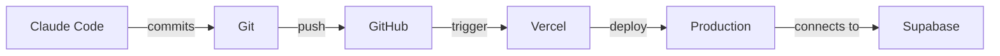

# 📇 Adressbuch

Modernes, dezentrales Adressbuch mit Next.js, Supabase und Vercel - ein vollständiges Beispiel für die Integration von Git, Vercel und Supabase mit Claude Code.

## 🚀 Features

- ✅ **Next.js 14** mit App Router und TypeScript
- ✅ **Supabase Backend** mit PostgreSQL Datenbank
- ✅ **Row Level Security (RLS)** für sichere Multi-User-Verwaltung
- ✅ **Vercel Deployment** mit automatischem CI/CD
- ✅ **Git Workflow** mit Feature Branches
- ✅ **Responsive Design** mit modernem UI
- ✅ **Real-time Updates** möglich durch Supabase
- ✅ **TypeScript** für Type Safety

## 📋 Voraussetzungen

- Node.js 18+ und npm
- Git
- Supabase Account (kostenlos: https://supabase.com)
- Vercel Account (kostenlos: https://vercel.com)

## 🛠️ Setup-Anleitung

### 1. Repository klonen

```bash
git clone <your-repo-url>
cd Adressbuch
```

### 2. Dependencies installieren

```bash
npm install
```

### 3. Supabase Projekt erstellen

1. Gehe zu [https://app.supabase.com](https://app.supabase.com)
2. Erstelle ein neues Projekt
3. Warte, bis die Datenbank bereit ist
4. Gehe zu **Settings** → **API**
5. Kopiere:
   - Project URL (NEXT_PUBLIC_SUPABASE_URL)
   - Anon/Public Key (NEXT_PUBLIC_SUPABASE_ANON_KEY)

### 4. Datenbank-Schema einrichten

1. Gehe zu **SQL Editor** in Supabase
2. Führe die Migrationen aus:
   - Öffne `supabase/migrations/001_create_contacts_table.sql`
   - Kopiere den Inhalt und führe ihn im SQL Editor aus
   - Wiederhole mit `002_seed_demo_data.sql`

Alternativ mit Supabase CLI:

```bash
npm install -g supabase
supabase login
supabase link --project-ref <your-project-ref>
supabase db push
```

### 5. Environment Variables einrichten

Erstelle eine `.env.local` Datei:

```bash
cp .env.example .env.local
```

Füge deine Supabase Credentials ein:

```env
NEXT_PUBLIC_SUPABASE_URL=https://your-project-id.supabase.co
NEXT_PUBLIC_SUPABASE_ANON_KEY=your-anon-key-here
```

### 6. Lokale Entwicklung starten

```bash
npm run dev
```

Öffne [http://localhost:3000](http://localhost:3000)

## 🌐 Vercel Deployment

### Option 1: Mit Vercel CLI

```bash
# Installiere Vercel CLI
npm install -g vercel

# Deploye das Projekt
vercel

# Füge Environment Variables hinzu
vercel env add NEXT_PUBLIC_SUPABASE_URL
vercel env add NEXT_PUBLIC_SUPABASE_ANON_KEY

# Production Deployment
vercel --prod
```

### Option 2: Mit Vercel Dashboard

1. Gehe zu [https://vercel.com](https://vercel.com)
2. Klicke auf "New Project"
3. Importiere dein Git Repository
4. Konfiguriere Environment Variables:
   - `NEXT_PUBLIC_SUPABASE_URL`
   - `NEXT_PUBLIC_SUPABASE_ANON_KEY`
5. Klicke auf "Deploy"

### Automatisches Deployment

Nach dem ersten Setup deployed Vercel automatisch:
- **Production**: Bei jedem Push zu `main`
- **Preview**: Bei jedem Push zu anderen Branches
- **Pull Request**: Bei jedem PR wird eine Preview-URL erstellt

## 🔄 Git Workflow mit Claude Code

Claude Code kann direkt mit Git arbeiten:

```bash
# Branch erstellen
git checkout -b feature/new-feature

# Änderungen committen (Claude Code macht das automatisch)
git add .
git commit -m "Add new feature"

# Push zu GitHub
git push -u origin feature/new-feature

# Pull Request erstellen
gh pr create --title "Add new feature" --body "Description"
```

## 📊 Supabase Features nutzen

### Authentifizierung hinzufügen

```typescript
import { supabase } from '@/lib/supabase'

// Sign up
const { data, error } = await supabase.auth.signUp({
  email: 'user@example.com',
  password: 'secure-password'
})

// Sign in
const { data, error } = await supabase.auth.signInWithPassword({
  email: 'user@example.com',
  password: 'secure-password'
})
```

### Real-time Updates

```typescript
// Subscribe zu Änderungen
supabase
  .channel('contacts')
  .on('postgres_changes',
    { event: '*', schema: 'public', table: 'contacts' },
    (payload) => {
      console.log('Change received!', payload)
    }
  )
  .subscribe()
```

## 📁 Projektstruktur

```
Adressbuch/
├── app/                    # Next.js App Router
│   ├── layout.tsx         # Root Layout
│   ├── page.tsx           # Homepage
│   └── globals.css        # Global Styles
├── components/            # React Komponenten
│   ├── ContactList.tsx    # Kontaktliste
│   └── AddContactForm.tsx # Formular für neue Kontakte
├── lib/                   # Business Logic
│   ├── supabase.ts       # Supabase Client
│   ├── database.types.ts # TypeScript Types
│   └── contacts.ts       # Kontakt-Funktionen
├── supabase/             # Supabase Konfiguration
│   └── migrations/       # SQL Migrationen
├── vercel.json           # Vercel Konfiguration
├── .env.example          # Environment Variables Template
└── package.json          # Dependencies
```

## 🔐 Sicherheit

- **Row Level Security (RLS)**: Jeder User sieht nur seine eigenen Kontakte
- **Environment Variables**: Sensible Daten niemals im Code
- **API Keys**: Nur Anon Key im Frontend, Service Role Key nur server-side

## 🎯 Nächste Schritte

1. **Authentication UI**: Login/Signup Seiten hinzufügen
2. **Kontakt bearbeiten**: Edit-Funktionalität implementieren
3. **Bildupload**: Profilbilder mit Supabase Storage
4. **Export**: Kontakte als CSV exportieren
5. **Import**: Kontakte aus CSV importieren
6. **Gruppen**: Kontakte in Kategorien organisieren
7. **Suche**: Erweiterte Suchfunktionen
8. **Tags**: Labels für bessere Organisation

## 🤝 Zusammenarbeit von Git, Vercel & Supabase



### Workflow-Beispiel

1. **Entwicklung mit Claude Code**
   - Code schreiben
   - Automatische Git Commits
   - Branch Management

2. **Git Push**
   - Code wird zu GitHub gepushed
   - Vercel erkennt automatisch Änderungen

3. **Vercel Build & Deploy**
   - Automatischer Build-Prozess
   - Environment Variables werden injiziert
   - Preview-URL wird erstellt

4. **Supabase Connection**
   - App verbindet sich mit Supabase
   - RLS policies schützen Daten
   - Real-time Updates funktionieren

## 📝 Verfügbare Scripts

```bash
npm run dev       # Entwicklungsserver starten
npm run build     # Production Build erstellen
npm run start     # Production Server starten
npm run lint      # ESLint ausführen
npm run type-check # TypeScript prüfen
```

## 🐛 Troubleshooting

### "Missing Supabase environment variables"
- Stelle sicher, dass `.env.local` existiert und korrekte Werte enthält
- Bei Vercel: Prüfe Environment Variables im Dashboard

### "Error fetching contacts"
- Prüfe, ob die Migrationen ausgeführt wurden
- Prüfe die RLS Policies in Supabase
- Stelle sicher, dass ein User eingeloggt ist

### Vercel Build Fehler
- Prüfe `vercel.json` Konfiguration
- Stelle sicher, dass alle Dependencies in `package.json` sind
- Prüfe Build Logs im Vercel Dashboard

## 📚 Ressourcen

- [Next.js Dokumentation](https://nextjs.org/docs)
- [Supabase Dokumentation](https://supabase.com/docs)
- [Vercel Dokumentation](https://vercel.com/docs)
- [Claude Code Dokumentation](https://docs.claude.com/claude-code)

## 📄 Lizenz

Siehe [LICENSE](LICENSE) Datei.

---

Erstellt mit Claude Code 🤖
